# 법인 고객 마케팅 월보

돈독(Don-Ddok) 팀, iM DiGital Banker Academy 9기 통계 프로젝트의 **실무 활용 프로토타입**입니다.

통계 프로젝트 "수출 경기 충격의 법인 여신 전이"의 결과를, 은행 **마케팅 담당자**가 "이번 달 어떤 법인 고객에게 무엇을 먼저 제안할지" 고르는 **월간 통계 보도자료 형식의 화면**으로 옮겼습니다.

**바로 보기: https://donddok.vercel.app**

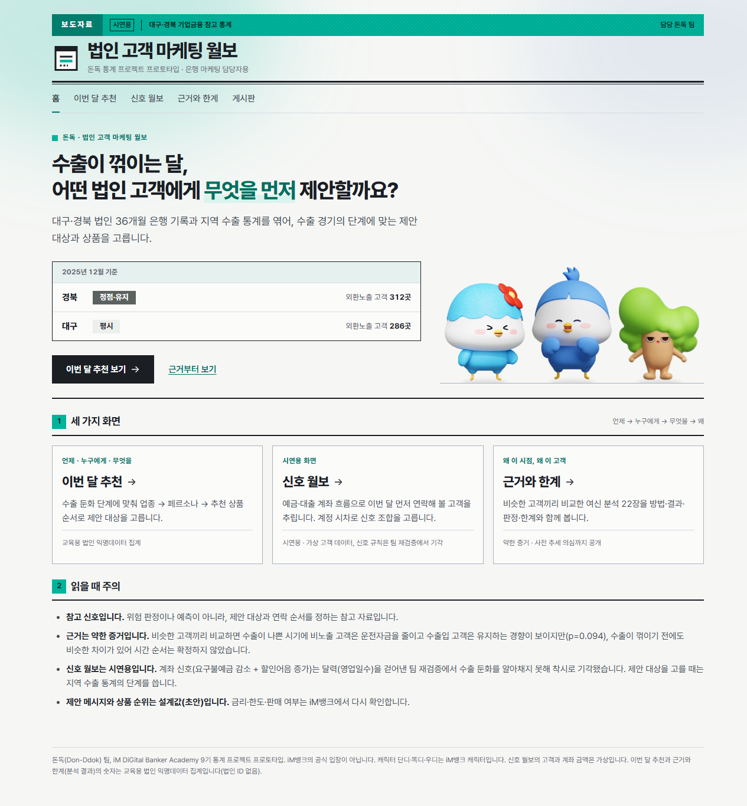

> 신호 월보의 고객과 계좌 금액은 **모두 가상 데이터**입니다. 이번 달 추천과 팀 인사이트의 숫자는 교육용 법인 익명데이터의 **집계**이며, 법인 ID·개별 잔액은 없고 1~4곳인 칸은 "5곳 미만"으로 가렸습니다. 교육 과정의 결과물이며 iM뱅크의 공식 입장이 아닙니다. 캐릭터 단디·똑디·우디는 iM뱅크 캐릭터입니다.

## 사이트 구성

윗줄 메뉴 여섯 개로 나뉩니다. 순서는 발표 흐름(언제·누구에게·무엇을 → 근거 → 효과는)을 따릅니다.

| 메뉴 | 주소 | 내용 |
|---|---|---|
| 홈 | `/` | 이번 달 지역별 수출 둔화 단계와 세 갈래 입구, 읽을 때 주의 |
| 이번 달 추천 | `/recommend` | 팀 매칭 모델: 단계(언제) → 업종·페르소나(누구에게) → 수출형·수입형별 추천 상품(무엇을). 예전 주소 `/campaign`은 조건을 유지한 채 옮겨 감 |
| 분석 결과 | `/results` | 최종 결과보고서 공통 사양: 요구불예금 시차별 반응, 6개 지표 판정표, 강건성, 확인한 범위. 예전 주소 `/analysis`는 이리로 옮겨 감 |
| 효과 검증 | `/pilot` | 파일럿 설계(B안): 관계유지 효과, 층화 무작위 1:1 실험 흐름, 주지표·안전지표, 검출 가능한 효과, 판정 기준 |
| 근거와 한계 | `/insight` · `/evidence` · `/bulletin` · `/glossary` | 팀 인사이트(관계 지도) · 시도했다 뺀 방법(계좌 신호 점검) · 신호 월보(시연용, 가상 고객 80곳: 월보 · 고객 · 계정 시차) · 용어 사전 35개 |
| 게시판 | `/board` | GitHub Discussions(giscus) |

화면 상태는 주소에 담깁니다. 신호 월보 계열은 `?m=YYYYMM`(기준월)과 `&c=loan|bill`(신호 조합), 이번 달 추천은 `?r=&cm=&v=&g=&s=&p=`(지역·기준월·단계·업종·페르소나)를 씁니다. 주소를 그대로 공유하면 같은 화면이 열리고 뒤로 가기도 됩니다.

## 이 화면이 기대는 결과

최종 결과보고서(2026-10-06)의 공통 사양으로 계정 여섯 개를 같은 식으로 다시 쟀습니다. 수출 증가율이 10%p 떨어지면 6개월 뒤 수출입 기업의 **요구불예금이 비교 기업보다 3.6% 낮았고**(p 0.003, Holm 보정 후에도 유의, 사전 추세 p 0.917, 검정력 87%), 보정 후에도 유의한 계정은 이것 하나였습니다. 인과가 아니라 지역 수출 경기와 함께 움직이는 관계이며, 입금이나 기업 자체 수출입 실적으로는 설명되지 않았습니다.

- **이번 달 추천**은 공식 수출통계로 **단계**를 판정하고, 은행 데이터로 업종·페르소나를 나눠 제안 대상과 상품을 고릅니다. 연락 순서는 요구불 규모와 최근 3개월 감소폭으로 정합니다(리드 스코어링).
- **효과 검증**은 이 상담이 실제로 요구불 잔액을 지키는지 무작위 비교 실험으로 확인하는 파일럿 설계입니다.
- **신호 월보**는 계좌 신호로 고객을 골라 본 **시연용** 화면입니다. 이 계좌 신호는 달력(영업일수)을 걷어낸 팀 재검증에서 수출 둔화를 알아채지 못해 **착시로 기각**됐고, 최종 모델에서는 뺐습니다. 그래서 윗줄 메뉴가 아니라 근거와 한계 안에 "시도했다 뺀 방법"과 함께 둡니다.

위험 판정이나 예측 도구가 아니라, 먼저 연락해 볼 순서를 정하는 참고 자료입니다.

## 화면 둘러보기

사진은 모두 배포 화면입니다(신호 월보 계열은 가상 고객).

### 1. 이번 달 추천

**언제(단계) → 누구에게(업종·페르소나) → 무엇을(추천 상품)** 순서로 좁혀 갑니다. 지역과 달을 고르면 그 달의 단계(평시, 관찰, 적기, 정점·유지, 장기둔화)와 대상이 바뀌고, 업종 카드에는 페르소나 A~E 분포가 함께 나옵니다.

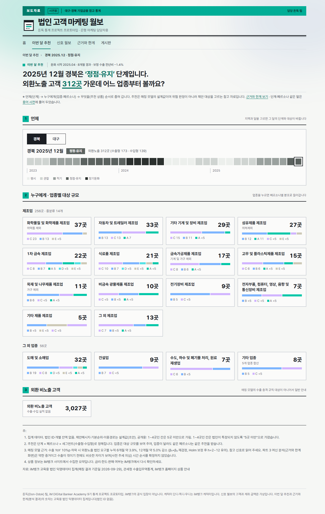

업종을 누르면 페르소나 분포로, 페르소나를 누르면 추천 상품으로 들어갑니다. 추천은 **단계 × 페르소나 × 세그먼트(수출형·수입형)**로 정해지므로 업종이 달라도 같은 페르소나는 같은 추천을 받습니다.

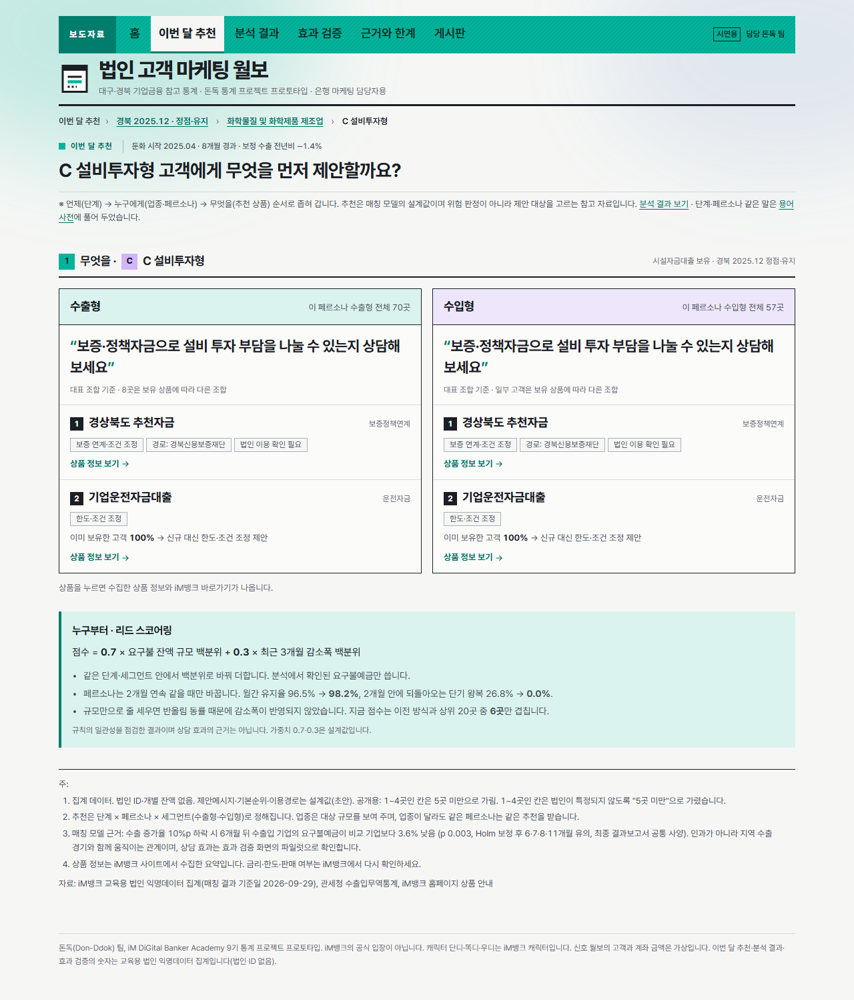

### 2. 신호 월보

기준월을 고르면 한 줄 요지, 대구·경북 수출 증감표와 막대, 살펴볼 고객, 기준에 가까운 고객이 차례로 나옵니다.


### 3. 신호 조합 고르기

요구불예금 잔액에 짝지을 계정(운전자금대출 또는 할인어음)을 고르면 월보·고객·고객 상세·근거와 한계가 모두 그 조합으로 다시 계산됩니다. 조합을 바꿔도 기준월은 그대로라 같은 달을 두 조합으로 견줘 볼 수 있습니다. 아래는 2023년 12월을 두 조합으로 본 모습입니다(조건 3과 표 칸이 바뀜).

<p>
  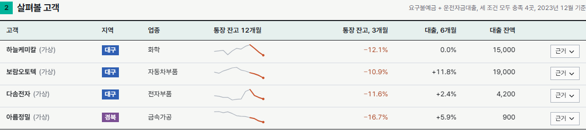
  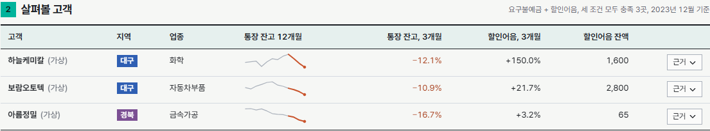
</p>

계정 시차 화면의 "신호 조합 고르기"에는 두 조합을 실제 은행 데이터로 점검한 결과를 나란히 둡니다. 조합은 점검한 두 가지만 둡니다(계정을 이것저것 붙여 잘 맞는 것을 고르면 과적합).

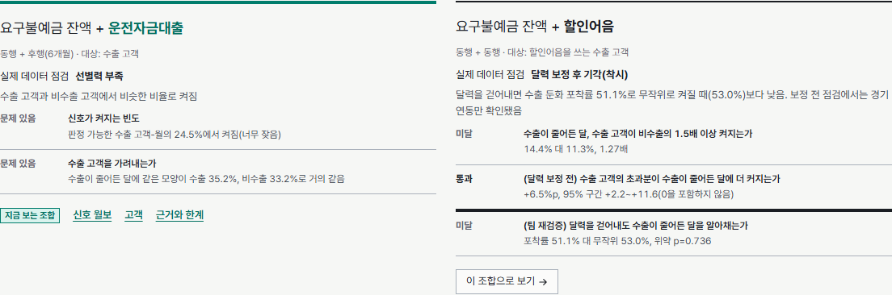

### 4. 근거 잇기

살펴볼 고객의 "근거"를 펼치면 세 조건(지역 수출 감소 → 통장 잔고 감소 → 대출 유지 또는 할인어음 증가)이 한 줄의 괘선으로 이어지며 그어집니다. 표 안의 작은 선은 최근 12개월 통장 잔고 흐름이고, 판정에 쓰는 마지막 3개월을 주황으로 표시합니다.


### 5. 고객 목록

80곳의 이번 달 상태를 한 번에 봅니다. 위쪽 개수 줄(전체, 충족, 기준 근접, 미충족, 해당 없음)을 누르면 그 상태만 걸러지고, 이름·지역·업종·수출 여부로도 좁힐 수 있습니다.


목록은 50곳씩, 월보의 살펴볼 고객은 20곳씩 쪽을 넘겨 봅니다. 걸러 보기 조건·기준월·조합이 바뀌면 첫 쪽으로 돌아갑니다(내부 시연의 실제 데이터는 한 달에 수백 곳이라 넣은 기능).

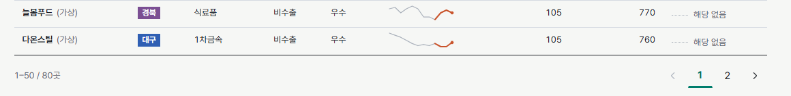

### 6. 고객 상세

지역·업종·수출 여부·할인어음·고객 등급을 다섯 칸 표로, 기준월 판정 근거, 연도별 신호 이력, 지역 수출·통장 잔고·짝 계정(대출 또는 할인어음)·수출 실적 그래프를 보여 줍니다. 그래프를 누르면 크게 볼 수 있습니다(Esc나 바깥 클릭으로 닫힘).

<p>
  
  
</p>

### 7. 계정 시차

수출이 꺾이면 은행 계정이 언제 움직이는지를 수출 흐름 여섯 단계(원자재 확보 → 생산·납품 → 선적 → 대금 회수 → 부족 대응 → 차입·투자 조정) 위에 놓았습니다. 선적(지역 수출통계 기록 시점)보다 먼저 움직이는 계정이 조기경보 후보입니다. 계정마다 예상 시차와 팀 중간보고서 결과를 같은 선 모양 규칙(일치, 예상과 다름·보류, 미검정, 관측 창 밖)으로 대조합니다. 운전자금대출·할인어음 칸의 버튼을 누르면 신호 조합이 바뀝니다. 예상 시차는 팀 분석 문서, 결과는 중간보고서 수치이며 이 화면에서 다시 계산하지 않았습니다.


### 8. 근거와 한계 · 팀 인사이트

수출 둔화에서 무엇이 이어지는지를 한 장의 관계 지도로 묶었습니다. 가운데에서 뻗은 여섯 가지(지역 수출, 예금 반응, 업종 노출, 수출–상품 보유 관계, 고객 군집, 검증된 가설)를 누르면 하위 노드가 펼쳐집니다. 가설 재검증 결과는 지지 1개·기각 2개·보류 1개이고, 기각된 가설은 추천 모델에 쓰지 않습니다.

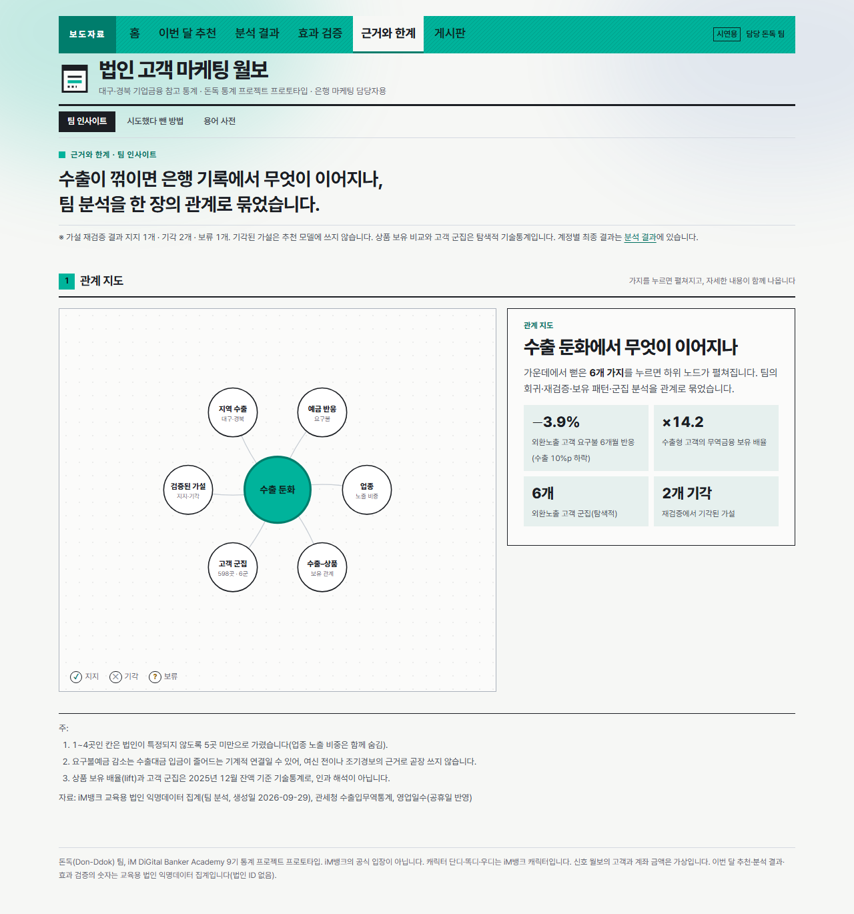

### 9. 분석 결과

최종 결과보고서의 공통 사양 결과를 한 화면에 모았습니다. 숫자 네 개(−3.6%, p 0.003, 사전 추세 p 0.917, 검정력 87%), 요구불예금의 0~12개월 시차별 반응(95% 신뢰구간 띠, 보정 후 유의한 시차는 채운 점), 6개 지표 판정표(보정 후 유의 · 보정 전만 유의 · 유의하지 않음), 추정 방식별 강건성, 그리고 확인한 범위("지역 수출 경기와의 동행 관계"까지)를 차례로 봅니다.

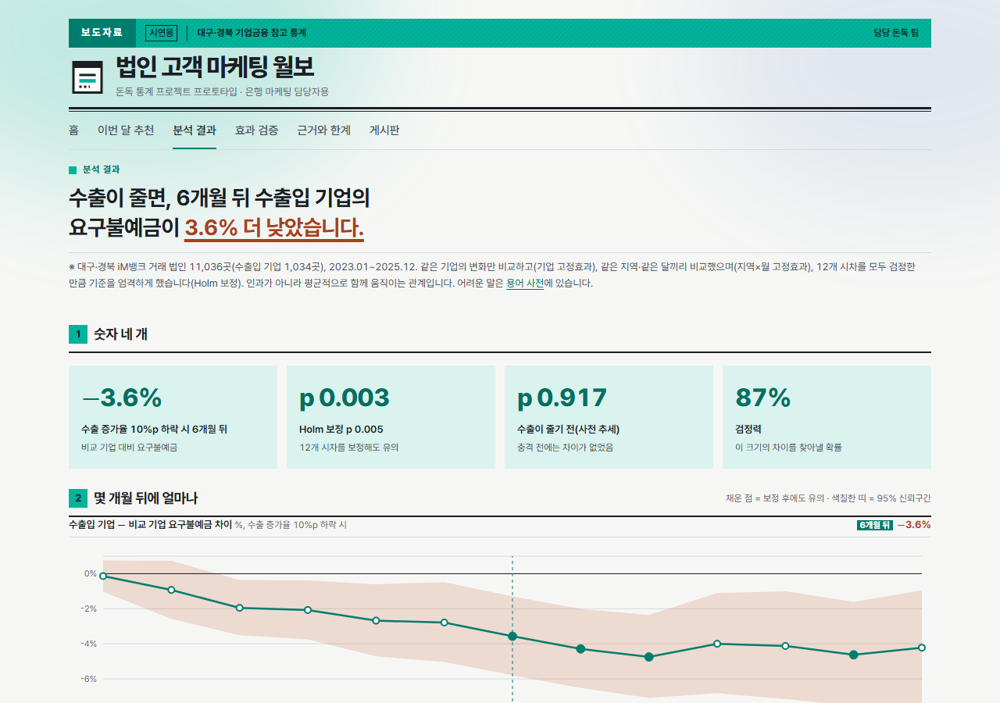

### 10. 효과 검증

상담 효과는 아직 검증하지 않았으므로, 그 효과를 재는 파일럿 설계를 보여 줍니다. 관계유지 효과(조기이탈률 27.37% vs 33.48%, 관찰된 차이), 실험 흐름(국면 판정 → 946곳 → 층화 무작위 1:1 → 3개월 안에 상담 → 4~6개월 차 비교), 주지표 요구불 잔액 유지율(기준선 45.5%)·보조지표·안전지표(연체율), 회차별 검출 가능한 효과(1회차 +10.3%p), 성공·보류·실패·중단 판정 기준을 적었습니다.

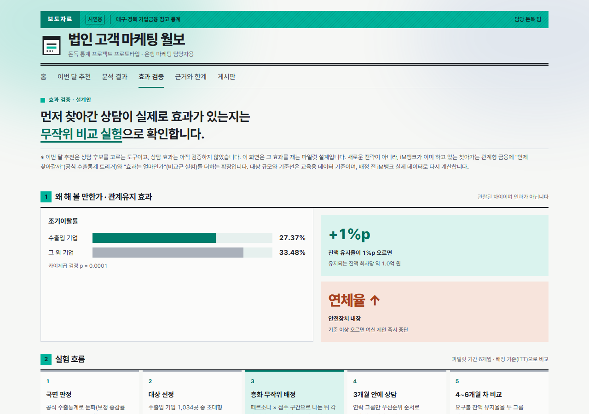

### 11. 근거와 한계 · 시도했다 뺀 방법

계좌 신호로 고객을 고르는 방법을 왜 뺐는지 기록합니다. 고른 조합에 맞춰 근거와 점검 결과가 바뀝니다. 운전자금 조합은 초기 여신 분석의 숫자(대출 변화 차이 2.3%, 같은 방향 24/24, p값 0.094, 검정력 39%)를 보여 주고, 최종 공통 사양에서는 운전자금이 유의하지 않았다는 점을 함께 적습니다.


할인어음 조합은 실행 전에 기준을 고정한 조합 점검표를 보여 줍니다. 세 기준 가운데 통과한 것은 달력 보정 전의 경기 연동 하나뿐이고, 팀 재검증에서 **달력 보정 후 기각(착시)**으로 판정됐습니다. 점검표의 판정은 선 모양으로 표시합니다(통과 굵은 실선, 미달 가는 선).

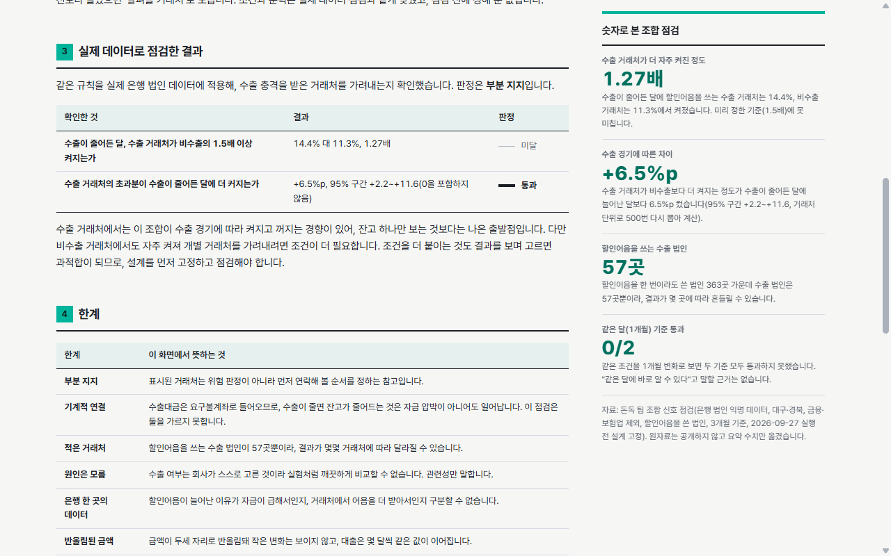

### 12. 근거와 한계 · 용어 사전

화면에 나오는 계정·고객 구분·경기와 시점·분석 방법·판정과 표시 용어 35개를 쉬운 말과 한 줄 비유로 풀었습니다. 검색하거나 갈래로 걸러 볼 수 있고, 용어마다 "나오는 곳"과 "다른 이름"을 적었습니다. 팀 문서로 아직 확인하지 못한 설명에는 "팀 확인 중" 표시를 답니다.

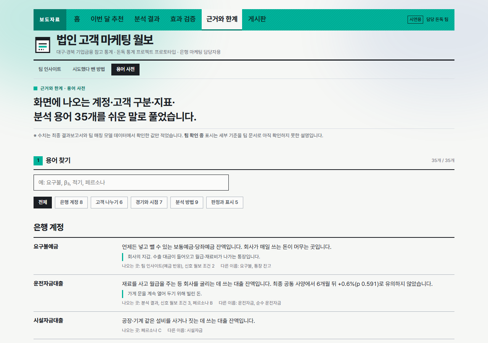

### 13. 게시판

팀원이 의견을 남기는 곳입니다. GitHub 계정으로 로그인해 글을 쓰고, 글은 이 저장소의 Discussions에 저장됩니다(giscus). 주제는 자유 의견, 분석 결과, 화면 개선 제안 세 가지이고, 공개 게시판이라 은행 데이터나 내부 시연 화면 캡처는 올리지 않습니다.

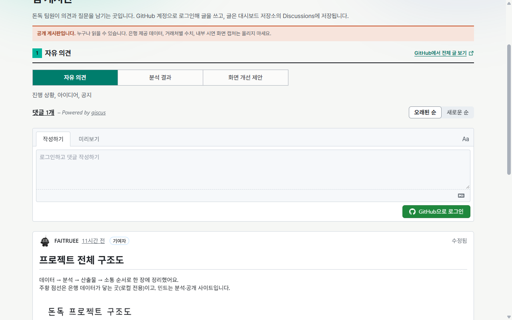

### 14. 휴대폰

폭이 좁으면 제목, 기준월, 메뉴, 신호 조합, 요지 순으로 쌓이고, 메뉴와 표는 옆으로 밀어 봅니다.


## 참고 신호 규칙

규칙 대상 고객이 아래 세 조건을 모두 충족하면 "살펴볼 고객"으로 표시합니다. 조건 3은 고른 조합에 따라 다릅니다.

1. 지역 수출이 1년 전 같은 달보다 감소
2. 통장 잔고가 3개월 전보다 10% 넘게 감소
3. 조합의 짝 계정 조건

| 조합 | 조건 3 | 규칙 대상 | 실제 데이터 점검 |
|---|---|---|---|
| 요구불예금 + 운전자금대출(기본) | 운전자금 대출이 6개월 전보다 5% 넘게 줄지 않음 | 수출 고객 | **선별력 부족**: 너무 자주 켜지고(24.5%) 수출·비수출에서 비슷하게 나타남(35.2% 대 33.2%) |
| 요구불예금 + 할인어음 | 할인어음 잔액이 3개월 전보다 늘어남 | 할인어음을 쓰는 수출 고객 | **달력 보정 후 기각(착시)**: 달력을 걷어내면 수출 둔화 포착률 51.1%로 무작위(53.0%)보다 낮음(위약 p=0.736). 보정 전 점검에서는 경기 연동만 확인(+6.5%p 통과, 1.27배는 기준 1.5배 미달) |

판정은 두 조합 모두 2023년 7월부터 합니다(대출 6개월 변화를 계산할 수 있는 첫 달). 조합은 실제 데이터로 점검한 두 가지만 둡니다. 계정을 이것저것 붙여 보며 잘 맞는 조합을 고르면 과적합이 되므로, 새 조합은 조건과 통과 기준을 먼저 문서로 고정하고 점검한 뒤 `src/data/combos.ts`에 추가합니다.

| 상태 | 표시 | 뜻 |
|---|---|---|
| 충족 | 굵은 실선 | 세 조건 모두 |
| 기준 근접 | 굵은 점선 | 1과 3은 충족, 잔고가 5~10% 감소 |
| 미충족 | 가는 실선 | 수출 고객이지만 해당 안 됨 |
| 해당 없음 | 점선 | 규칙 대상이 아닌 고객(수출 실적 없음, 할인어음 조합에서는 할인어음 거래 없음) |

상태는 색이 아니라 **선 모양**으로 구분해, 색 구분이 어려운 사람도 읽을 수 있습니다. 증감도 색(증가 민트, 감소 주황)과 함께 기준선 위·아래 위치와 부호로 표시합니다.

문턱값은 설명하기 쉽게 정한 값입니다. 실제 데이터에 같은 규칙을 적용해 보니 신호가 너무 자주 켜지고 비수출 고객에서도 비슷하게 나타나, **이 문턱 그대로는 수출 충격을 받은 고객을 가려내지 못했습니다.** 실무에 쓰려면 조건과 문턱을 다시 설계하고 사후 결과로 검증해야 합니다. 화면에는 팀 문서(Don-Ddok_Docs)에 공개한 요약 수치만 옮겼고, 월별·지역별 집계는 아래 내부 시연 모드에서만 봅니다.

## 데이터

| 데이터 | 출처 | 파일 |
|---|---|---|
| 대구·경북 월별 수출액과 전년동월비(2022.01~2025.12) | 관세청 수출입무역통계, 한국무역협회 K-stat 지역별 수출입(전체 품목). 원자료와 대조 확인 | `src/data/regionExports.ts` |
| 가상 고객 80곳, 36개월 계좌 흐름(통장 잔고, 운전자금 대출, 할인어음, 수출 실적) | 씨앗을 고정한 난수로 생성. 할인어음은 고객마다 따로 씨앗을 써서 기존 잔고·대출 흐름을 바꾸지 않음. 은행 데이터처럼 금액을 유효숫자 두세 자리로 반올림 | `src/data/synthetic.ts` |
| 이번 달 추천(단계 × 업종 × 페르소나 × 추천 상품) | 팀 매칭 모델 결과(`demo/live_data.json`)의 집계. `python scripts/mask-campaign.py <live_data.json>`으로 1~4곳 칸을 -1(5곳 미만)로 바꾸고 두 파일로 나눔 | `public/data/campaign.json`, 읽는 곳 `src/data/campaign.ts` |
| 팀 인사이트 관계 지도 | 같은 스크립트로 만든 집계(가설 재검증, 예금 반응, 업종 노출, 상품 보유, 고객 군집) | `public/data/insight.json`, `src/data/insight.ts` |
| 분석 결과·효과 검증 수치 | 돈독 최종 결과보고서(2026-10-06), 최종 발표자료, 파일럿 설계서 B안 | `src/data/final.ts` |
| 용어 사전 35개 | 최종 결과보고서와 팀 매칭 모델 데이터에서 확인한 값만 적음 | `src/data/glossary.ts` |
| 계정 시차(예상 시차와 중간보고서 결과) | 팀 분석 문서 "지역 수출 대비 은행 계정의 예상 시차", 팀 중간보고서 시차 분석 | `src/data/accountTiming.ts` |
| 영업일수 | `holidays` 라이브러리로 만든 월별 영업일수(조건 1의 참고 표시) | `src/data/workdays.ts` |

가상 데이터는 **규칙이 작동하는 모습을 보이도록 만든 시연용**입니다. 화면에서 규칙이 수출 고객을 잘 골라내는 것처럼 보이는 것은 데이터를 그렇게 만들었기 때문이며, 연구 결과의 근거가 아닙니다.

| 가상 데이터의 가정 | 근거 | 검정 여부 |
|---|---|---|
| 수출이 줄 때 비수출 회사는 대출을 줄이고, 수출 회사는 유지 | 초기 여신 분석(비슷한 기업끼리 비교) | 방향만 검정됨(p=0.094). 최종 공통 사양에서는 운전자금 유의하지 않음. 반응 크기는 임의 |
| 수출이 줄 때 수출 회사의 통장 잔고가 비수출 회사보다 크게 줄어듦 | 팀 중간보고서의 요구불예금 반응(예비 관찰)을 바탕으로 한 가정 | **검정 안 함.** 실제 데이터에서는 수출·비수출 고객의 잔고 감소 비율이 거의 같아 확인되지 않음 |
| 수출이 줄 때 수출 회사가 어음 할인을 더 자주, 더 많이 함 | 팀 시차 분석의 할인어음 반응(같은 달, 예비 관찰). 할인어음을 쓰는 고객 비율(수출 70%, 비수출 35%)은 실제보다 훨씬 많게 둠 | **검정 안 함.** 실제 데이터에서 조합은 달력 보정 전 경기 연동만 확인됐고, 보정 후 팀 재검증에서 착시로 기각. 할인어음 단독의 수출·비수출 차이도 근거 없음 |
| 잔고 흔들림 크기, 첫 화면 기준월 | 사례가 적당히 보이도록 맞춤 | 해당 없음(화면 연출) |

## 실행

Node.js 22 이상이 필요합니다.

```bash
npm install
npm run dev
```

| 명령 | 내용 |
|---|---|
| `npm run dev` | 개발 서버 |
| `npm run build` | 타입 검사 후 배포용 빌드(`dist/`) |
| `npm run preview` | 빌드 결과 미리보기 |
| `npm run lint` | ESLint |
| `node ./node_modules/tsx/dist/cli.mjs scripts/check-data.ts` | 가상 데이터 점검(회사 수, 월별 신호 수) |

## 내부 시연 모드(실제 데이터, 로컬 전용)

발표 준비용으로, 이 컴퓨터에서만 실제 법인 데이터로 화면을 엽니다. 실제 데이터와 파생 파일은 이 저장소에 없습니다.

- **월보·고객·고객 상세**: 가상 고객 대신 실제 법인(대구·경북 외환 거래 법인 1,032곳, 익명 법인ID 앞 8자리)으로 두 신호 조합을 계산합니다. 그 달에 은행 거래 기록이 없는 법인은 목록에서 빠지고, 상세 그래프에서는 그 달을 비워 둡니다.
- **규칙 점검(실제 집계)**: 규칙을 실제 데이터에 적용한 집계. 개별 법인은 나오지 않고, 5 미만인 칸은 가립니다.
- 이번 달 추천·계정 시차·근거와 한계·게시판은 배포 화면과 같습니다.

### 가상 데이터와 실제 데이터의 차이

| | 배포 화면(가상) | 내부 시연(실제) |
|---|---|---|
| 고객 | 지어낸 80곳, "가람전자(가상)" | 대구·경북 외환 거래 법인 1,032곳(수출 523곳), "법인 + 익명 ID 앞 8자리" |
| 관측 기간 | 36개월 모두 값이 있음 | 은행 거래가 없던 달은 값이 없음. 그 달은 목록에서 빠지고 그래프에서 비워 둠 |
| 한 달 고객 수 | 80곳 | 기록이 있는 법인 수백 곳(2025년 11월 769곳) |
| 수출 실적 단위 | 만 달러 | 백만 달러(추정 단위) |
| 규칙이 걸리는 모습 | 연구 방향(수출 회사는 대출 유지)을 **심어서 만든 값**이라 잘 걸리는 것처럼 보임 | 심은 가정 없는 관측값. 두 조합 모두 수출·비수출을 가려내는 힘이 부족함(근거와 한계 화면의 점검 결과와 같음) |
| 쓰임 | 화면이 어떻게 생겼는지 보여 주는 프로토타입 시연 | 그 규칙이 실제로 통하는지 확인하는 검증 |
| 볼 수 있는 곳 | https://donddok.vercel.app | 이 컴퓨터의 개발 서버(127.0.0.1)만 |

같은 규칙을 화면과 분석 스크립트에서 따로 계산해 맞춰 봤습니다. 2025년 11월 운전자금 조합의 살펴볼 고객은 화면 62곳, `internal_demo_summary.py` 집계 62곳(대구 0, 경북 62)으로 같습니다.

1. 팀 분석 폴더(`파트3_여신업종분석/단계별 분석`)에서 `internal_demo_summary.py`(집계), `combo_signal_check.py`(조합 점검), `internal_firms_export.py`(법인 단위 월별 잔액)를 실행합니다. 결과는 모두 `내부시연/` 폴더에 생깁니다.
2. 이 저장소 루트에 `.env.internal.local`을 만들고 집계 파일 경로를 적습니다(저장소에 올라가지 않는 파일). 같은 폴더의 `combo_check.json`, `firms.json`도 함께 읽습니다.
   ```
   INTERNAL_SUMMARY=C:/경로/내부시연/summary.json
   ```
3. 내부 시연 모드로 켭니다.
   ```bash
   npm run dev:internal
   ```

| 장치 | 내용 |
|---|---|
| 접속 제한 | 127.0.0.1에서만 열리고 다른 컴퓨터의 요청은 거절 |
| 배포 차단 | `vite build --mode internal`은 오류로 멈춤. 일반 빌드 결과물에는 내부 화면·메뉴·주소가 들어가지 않음 |
| 표시 | 맨 위 주황 경고 띠 "월보·고객은 실제 은행 법인 데이터, 외부 공유·캡처 배포 금지", 고객 이름에 "(가상)" 대신 "법인 + ID", 각주·자료 출처도 실제 데이터로 바뀜 |

법인 단위 화면은 집계와 달리 개별 법인의 잔액이 그대로 보이므로 캡처해서 공유하지 않습니다. 코드·문서·예시 문구에도 실제 법인ID를 쓰지 않습니다(배포 전에 `dist/`와 소스에 실제 ID가 없는지 확인). 실제 데이터를 발표에 쓰기 전에는 과정(강사·은행)의 이용 조건을 먼저 확인합니다.

## 배포

Vercel에 연결돼 있어 `main`에 병합되면 자동으로 빌드해 올립니다.

| 항목 | 값 |
|---|---|
| 공개 주소 | https://donddok.vercel.app |
| 프레임워크 | Vite |
| 빌드 명령 | `npm run build` |
| 결과 폴더 | `dist` |
| 주소 재작성 | 필요 없음(해시 주소 `#/firms` 방식) |

- 외부에 공유할 때는 위 공개 주소를 씁니다. 배포마다 생기는 긴 주소(`donddok-xxxx-….vercel.app`)와 PR 미리보기 주소는 Vercel 보호 설정 때문에 로그인해야 열립니다.
- PR을 올리면 Vercel이 미리보기 배포를 만들어 PR에 링크를 남깁니다. 병합 전에 화면을 확인할 때 씁니다.
- 내부 시연 모드(실제 데이터)는 배포 빌드에 들어가지 않습니다.

## 기술

- React 19, TypeScript, Vite 6
- react-router(해시 주소, 정적 호스팅용), recharts(그래프, 상세·내부 시연 화면에서만 불러옴)
- Pretendard(프로젝트 안에 포함), Phosphor 아이콘
- 데이터 출처는 `src/lib/data.tsx`(배포는 가상, 내부 시연은 실제), 신호 조합은 `src/data/combos.ts`, 규칙 판정은 `src/data/signals.ts`
- 스타일은 CSS 변수로 만든 자체 토큰(`src/styles/tokens.css`). 카드와 그림자 없이 괘선과 글자 크기로 위계를 만듭니다. 자세한 규칙은 `DESIGN.md`.

## 디자인 기록

| 문서 | 내용 |
|---|---|
| `PRODUCT.md` | 사용자, 목적, 제약(은행 데이터 사용 금지), 원칙 |
| `DESIGN.md` | 색, 서체, 간격, 괘선, 상태 표시 등 시각 체계 |
| `.impeccable/` | 디자인 방향 선택 기록과 방향 계약 |

## 팀

돈독(Don-Ddok): [GitHub 조직](https://github.com/Don-Ddok). 분석 코드는 [Don-Ddok_Data](https://github.com/Don-Ddok/Don-Ddok_Data), 문서는 [Don-Ddok_Docs](https://github.com/Don-Ddok/Don-Ddok_Docs)에 있습니다.
