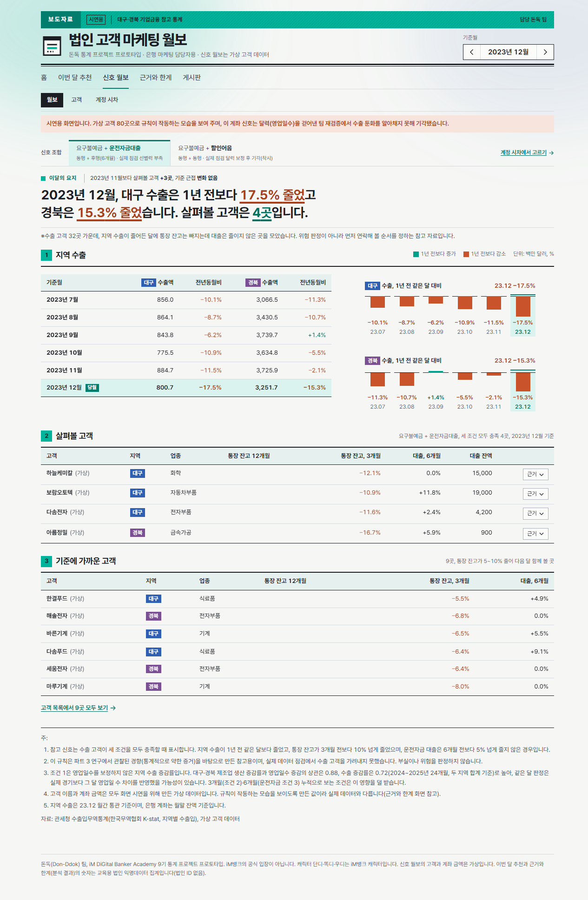
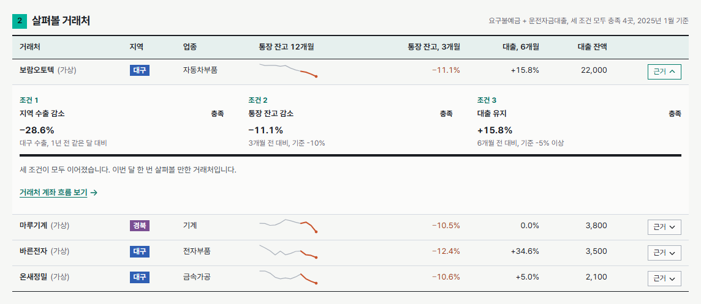
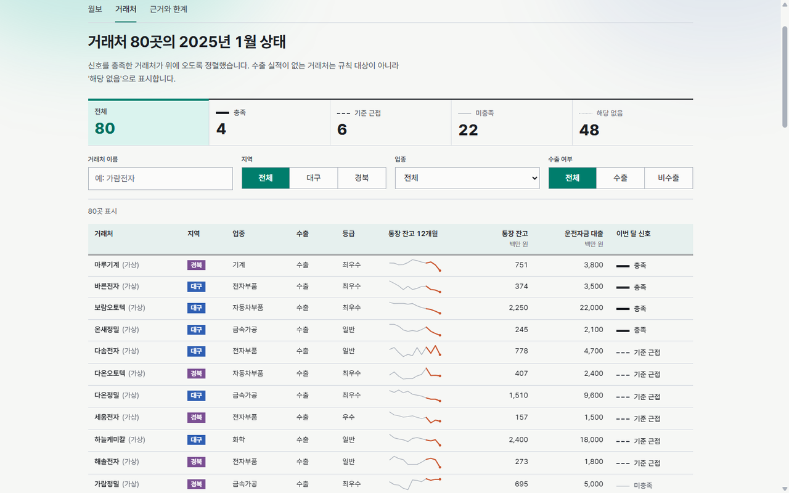
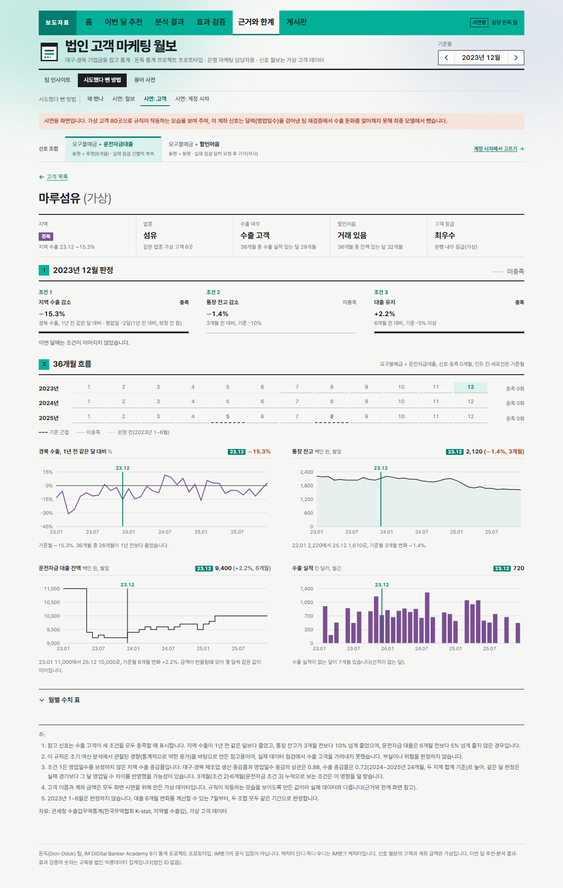
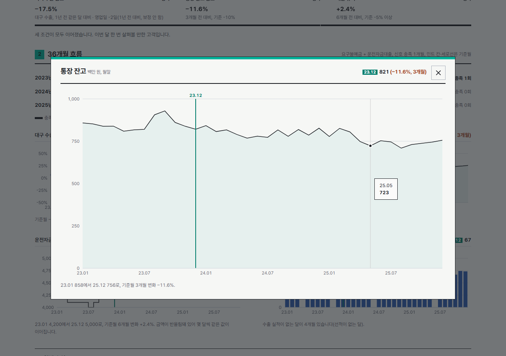
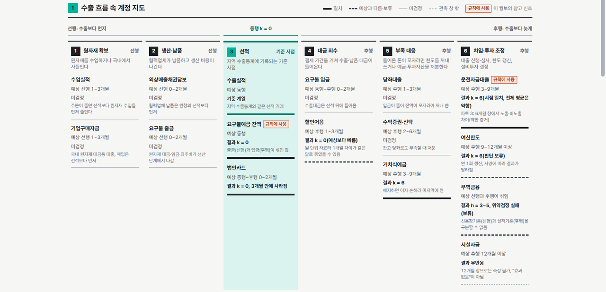
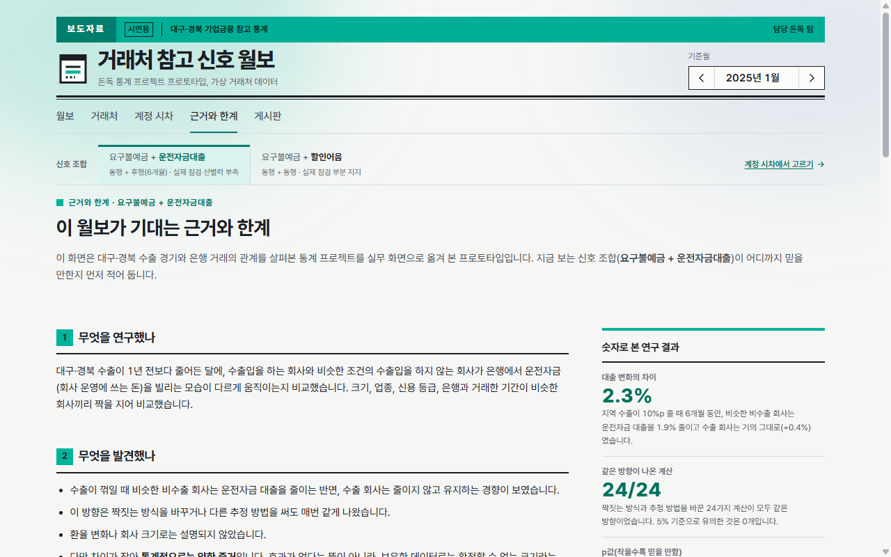
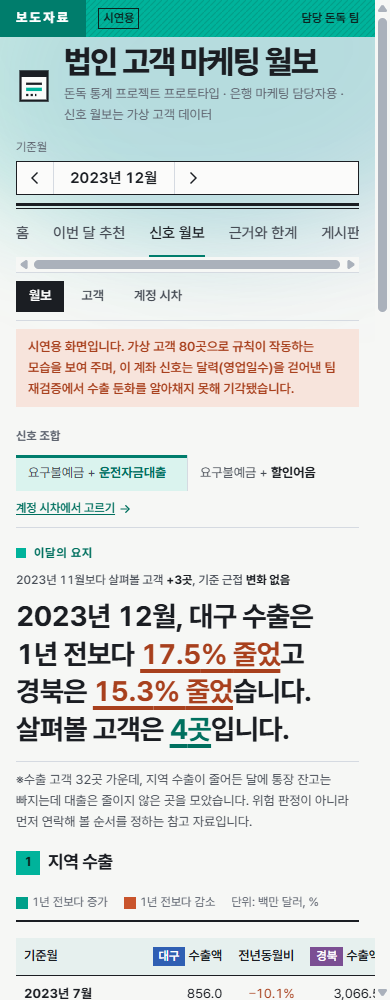

# 거래처 참고 신호 월보

돈독(Don-Ddok) 팀, iM DiGital Banker Academy 9기 통계 프로젝트의 **실무 활용 프로토타입**입니다.

통계 프로젝트 "수출 경기 충격의 법인 여신 전이"에서 관찰한 경향을, 은행 기업금융 담당자가 아침에 여는 **월간 통계 보도자료 형식의 화면**으로 옮겼습니다.

**바로 보기: https://donddok.vercel.app**



> 이 저장소의 거래처와 계좌 금액은 **모두 가상 데이터**입니다. 은행 제공 데이터는 한 줄도 포함하지 않습니다. 교육 과정의 결과물이며 iM뱅크의 공식 입장이 아닙니다.

## 무엇을 보여 주나

연구에서, 수출이 꺾일 때 비슷한 조건의 비수출 회사는 운전자금 대출을 줄이는 반면 수출 회사는 유지하는 경향이 보였습니다(통계적으로는 약한 증거). 이 화면은 그 경향을 거꾸로 읽어, 담당자가 **먼저 연락해 볼 거래처의 순서**를 정하는 참고 자료로 씁니다. 위험 판정 도구가 아닙니다.

신호는 요구불예금 잔액에 짝 계정 하나를 붙인 **조합**으로 봅니다. 실제 데이터로 점검한 두 조합(요구불예금 + 운전자금대출, 요구불예금 + 할인어음) 가운데 하나를 고르면 월보·거래처·근거와 한계 화면이 모두 그 조합으로 바뀝니다.

## 화면 둘러보기

### 1. 월보

기준월을 고르면 한 줄 요지, 대구·경북 수출 증감표와 막대, 살펴볼 거래처, 기준에 가까운 거래처가 차례로 나옵니다. 주소 끝의 `?m=YYYYMM`에 기준월이, `&c=bill`에 신호 조합(할인어음)이 담겨, 주소를 공유하면 같은 화면이 열립니다. 머리 아래 "신호 조합" 줄에서 조합을 바꿀 수 있습니다.

### 2. 근거 잇기

살펴볼 거래처의 "근거"를 펼치면 세 조건(지역 수출 감소 → 통장 잔고 감소 → 대출 유지 또는 할인어음 증가)이 한 줄의 괘선으로 이어지며 그어집니다. 표 안의 작은 선은 최근 12개월 통장 잔고 흐름이고, 판정에 쓰는 마지막 3개월을 주황으로 표시합니다.



### 3. 거래처 목록

80곳의 이번 달 상태를 한 번에 봅니다. 위쪽 개수 줄(전체, 충족, 기준 근접, 미충족, 해당 없음)을 누르면 그 상태만 걸러지고, 지역·업종·수출 여부로도 좁힐 수 있습니다.



### 4. 거래처 상세

지역·업종·수출 여부·등급을 네 칸 표로, 기준월 판정 근거, 연도별 신호 이력, 지역 수출·통장 잔고·짝 계정(대출 또는 할인어음)·수출 실적 그래프를 보여 줍니다. 그래프를 누르면 크게 볼 수 있습니다(Esc나 바깥 클릭으로 닫힘).

<p>
  
  
</p>

### 5. 계정 시차

수출이 꺾이면 은행 계정이 언제 움직이는지를 수출 흐름 여섯 단계(원자재 확보 → 생산·납품 → 선적 → 대금 회수 → 부족 대응 → 차입·투자 조정) 위에 놓았습니다. 선적(지역 수출통계 기록 시점)보다 먼저 움직이는 계정이 조기경보 후보입니다. 계정마다 예상 시차와 팀 중간보고서 결과를 같은 선 모양 규칙(일치, 예상과 다름·보류, 미검정, 관측 창 밖)으로 대조합니다. 지도에서 운전자금대출이나 할인어음을 누르면 요구불예금 잔액과 짝지은 신호 조합이 바뀌고, 아래 "신호 조합 고르기"에서 두 조합의 실제 데이터 점검 결과를 나란히 봅니다. 예상 시차는 팀 분석 문서, 결과는 중간보고서 수치이며 이 화면에서 다시 계산하지 않았습니다.



### 6. 근거와 한계

고른 조합에 맞춰 근거와 점검 결과가 바뀝니다. 운전자금 조합은 연구의 핵심 숫자(대출 변화 차이 2.3%, 같은 방향 24/24, p값 0.094, 검정력 39%)와 "약한 증거" 눈금을, 할인어음 조합은 팀 시차 분석에서 나온 배경과 실행 전에 기준을 고정한 조합 점검(1.27배, +6.5%p, 57곳, 1개월 기준 0/2)을 보여 줍니다.



### 7. 휴대폰

폭이 좁으면 제목, 기준월, 요지 순으로 쌓이고, 표는 칸을 줄이거나 옆으로 밀어 봅니다.



## 참고 신호 규칙

규칙 대상 거래처가 아래 세 조건을 모두 충족하면 "살펴볼 거래처"로 표시합니다. 조건 3은 고른 조합에 따라 다릅니다.

1. 지역 수출이 1년 전 같은 달보다 감소
2. 통장 잔고가 3개월 전보다 10% 넘게 감소
3. 조합의 짝 계정 조건

| 조합 | 조건 3 | 규칙 대상 | 실제 데이터 점검 |
|---|---|---|---|
| 요구불예금 + 운전자금대출(기본) | 운전자금 대출이 6개월 전보다 5% 넘게 줄지 않음 | 수출 거래처 | 선별력 부족: 너무 자주 켜지고(24.5%) 수출·비수출에서 비슷하게 나타남(35.2% 대 33.2%) |
| 요구불예금 + 할인어음 | 할인어음 잔액이 3개월 전보다 늘어남 | 할인어음을 쓰는 수출 거래처 | 부분 지지: 수출 경기에 따라 켜지고 꺼짐(+6.5%p), 가려내는 힘은 기준 미달(1.27배, 기준 1.5배) |

판정은 두 조합 모두 2023년 7월부터 합니다(대출 6개월 변화를 계산할 수 있는 첫 달). 조합은 실제 데이터로 점검한 두 가지만 둡니다. 계정을 이것저것 붙여 보며 잘 맞는 조합을 고르면 과적합이 되므로, 새 조합은 조건과 통과 기준을 먼저 문서로 고정하고 점검한 뒤 `src/data/combos.ts`에 추가합니다.

| 상태 | 표시 | 뜻 |
|---|---|---|
| 충족 | 굵은 실선 | 세 조건 모두 |
| 기준 근접 | 굵은 점선 | 1과 3은 충족, 잔고가 5~10% 감소 |
| 미충족 | 가는 실선 | 수출 거래처지만 해당 안 됨 |
| 해당 없음 | 점선 | 규칙 대상이 아닌 거래처(수출 실적 없음, 할인어음 조합에서는 할인어음 거래 없음) |

상태는 색이 아니라 **선 모양**으로 구분해, 색 구분이 어려운 사람도 읽을 수 있습니다. 증감도 색(증가 민트, 감소 주황)과 함께 기준선 위·아래 위치와 부호로 표시합니다.

문턱값은 설명하기 쉽게 정한 값입니다. 실제 데이터에 같은 규칙을 적용해 보니 신호가 너무 자주 켜지고 비수출 거래처에서도 비슷하게 나타나, **이 문턱 그대로는 수출 충격을 받은 거래처를 가려내지 못했습니다.** 실무에 쓰려면 조건과 문턱을 다시 설계하고 사후 결과로 검증해야 합니다. 화면에는 팀 문서(Don-Ddok_Docs)에 공개한 요약 수치만 옮겼고, 월별·지역별 집계는 아래 내부 시연 모드에서만 봅니다.

## 데이터

| 데이터 | 출처 | 파일 |
|---|---|---|
| 대구·경북 월별 수출액과 전년동월비(2022.01~2025.12) | 관세청 수출입무역통계, 한국무역협회 K-stat 지역별 수출입(전체 품목). 원자료와 대조 확인 | `src/data/regionExports.ts` |
| 가상 거래처 80곳, 36개월 계좌 흐름(통장 잔고, 운전자금 대출, 할인어음, 수출 실적) | 씨앗을 고정한 난수로 생성. 할인어음은 거래처마다 따로 씨앗을 써서 기존 잔고·대출 흐름을 바꾸지 않음. 은행 데이터처럼 금액을 유효숫자 두세 자리로 반올림 | `src/data/synthetic.ts` |

가상 데이터는 **규칙이 작동하는 모습을 보이도록 만든 시연용**입니다. 화면에서 규칙이 수출 거래처를 잘 골라내는 것처럼 보이는 것은 데이터를 그렇게 만들었기 때문이며, 연구 결과의 근거가 아닙니다.

| 가상 데이터의 가정 | 근거 | 검정 여부 |
|---|---|---|
| 수출이 줄 때 비수출 회사는 대출을 줄이고, 수출 회사는 유지 | 파트 3 매칭 비교 | 방향만 검정됨(약한 증거, p=0.094). 반응 크기는 임의 |
| 수출이 줄 때 수출 회사의 통장 잔고가 비수출 회사보다 크게 줄어듦 | 팀 중간보고서의 요구불예금 반응(예비 관찰)을 바탕으로 한 가정 | **검정 안 함.** 실제 데이터에서는 수출·비수출 거래처의 잔고 감소 비율이 거의 같아 확인되지 않음 |
| 수출이 줄 때 수출 회사가 어음 할인을 더 자주, 더 많이 함 | 팀 시차 분석의 할인어음 반응(같은 달, 예비 관찰). 할인어음을 쓰는 거래처 비율(수출 70%, 비수출 35%)은 실제보다 훨씬 많게 둠 | **검정 안 함.** 실제 데이터에서 조합으로는 부분 지지, 할인어음 단독의 수출·비수출 차이는 근거 없음 |
| 잔고 흔들림 크기, 첫 화면 기준월 | 사례가 적당히 보이도록 맞춤 | 해당 없음(화면 연출) |

## 실행

Node.js 22 이상이 필요합니다.

```bash
npm install
npm run dev
```

| 명령 | 내용 |
|---|---|
| `npm run dev` | 개발 서버 |
| `npm run build` | 타입 검사 후 배포용 빌드(`dist/`) |
| `npm run preview` | 빌드 결과 미리보기 |
| `node ./node_modules/tsx/dist/cli.mjs scripts/check-data.ts` | 가상 데이터 점검(회사 수, 월별 신호 수) |

## 내부 시연 모드(실제 데이터, 로컬 전용)

발표 준비용으로, 이 컴퓨터에서만 실제 법인 데이터로 화면을 엽니다. 실제 데이터와 파생 파일은 이 저장소에 없습니다.

- **월보·거래처·거래처 상세**: 가상 거래처 대신 실제 법인(대구·경북 외환 거래 법인 1,032곳, 익명 법인ID 앞 8자리)으로 두 신호 조합을 계산합니다. 그 달에 은행 거래 기록이 없는 법인은 목록에서 빠지고, 상세 그래프에서는 그 달을 비워 둡니다.
- **규칙 점검(실제 집계)**: 규칙을 실제 데이터에 적용한 집계. 개별 법인은 나오지 않고, 5 미만인 칸은 가립니다.
- 계정 시차·근거와 한계·게시판은 배포 화면과 같습니다.

1. 팀 분석 폴더(`파트3_여신업종분석/단계별 분석`)에서 `internal_demo_summary.py`(집계), `combo_signal_check.py`(조합 점검), `internal_firms_export.py`(법인 단위 월별 잔액)를 실행합니다. 결과는 모두 `내부시연/` 폴더에 생깁니다.
2. 이 저장소 루트에 `.env.internal.local`을 만들고 집계 파일 경로를 적습니다(저장소에 올라가지 않는 파일). 같은 폴더의 `combo_check.json`, `firms.json`도 함께 읽습니다.
   ```
   INTERNAL_SUMMARY=C:/경로/내부시연/summary.json
   ```
3. 내부 시연 모드로 켭니다.
   ```bash
   npm run dev:internal
   ```

| 장치 | 내용 |
|---|---|
| 접속 제한 | 127.0.0.1에서만 열리고 다른 컴퓨터의 요청은 거절 |
| 배포 차단 | `vite build --mode internal`은 오류로 멈춤. 일반 빌드 결과물에는 내부 화면·메뉴·주소가 들어가지 않음 |
| 표시 | 맨 위 주황 경고 띠 "월보·거래처는 실제 은행 법인 데이터, 외부 공유·캡처 배포 금지", 거래처 이름에 "(가상)" 대신 "법인 + ID", 각주·자료 출처도 실제 데이터로 바뀜 |

법인 단위 화면은 집계와 달리 개별 법인의 잔액이 그대로 보이므로 캡처해서 공유하지 않습니다. 실제 데이터를 발표에 쓰기 전에는 과정(강사·은행)의 이용 조건을 먼저 확인합니다.

## 배포

Vercel에 연결돼 있어 `main`에 병합되면 자동으로 빌드해 올립니다.

| 항목 | 값 |
|---|---|
| 공개 주소 | https://donddok.vercel.app |
| 프레임워크 | Vite |
| 빌드 명령 | `npm run build` |
| 결과 폴더 | `dist` |
| 주소 재작성 | 필요 없음(해시 주소 `#/firms` 방식) |

- 외부에 공유할 때는 위 공개 주소를 씁니다. 배포마다 생기는 긴 주소(`donddok-xxxx-….vercel.app`)와 PR 미리보기 주소는 Vercel 보호 설정 때문에 로그인해야 열립니다.
- PR을 올리면 Vercel이 미리보기 배포를 만들어 PR에 링크를 남깁니다. 병합 전에 화면을 확인할 때 씁니다.
- 내부 시연 모드(실제 데이터)는 배포 빌드에 들어가지 않습니다.

## 기술

- React 19, TypeScript, Vite 6
- react-router(해시 주소, 정적 호스팅용), recharts(그래프, 상세·내부 시연 화면에서만 불러옴)
- Pretendard(프로젝트 안에 포함), Phosphor 아이콘
- 스타일은 CSS 변수로 만든 자체 토큰(`src/styles/tokens.css`). 카드와 그림자 없이 괘선과 글자 크기로 위계를 만듭니다. 자세한 규칙은 `DESIGN.md`.

## 디자인 기록

| 문서 | 내용 |
|---|---|
| `PRODUCT.md` | 사용자, 목적, 제약(은행 데이터 사용 금지), 원칙 |
| `DESIGN.md` | 색, 서체, 간격, 괘선, 상태 표시 등 시각 체계 |
| `.impeccable/` | 디자인 방향 선택 기록과 방향 계약 |

## 팀

돈독(Don-Ddok): [GitHub 조직](https://github.com/Don-Ddok). 분석 코드는 [Don-Ddok_Data](https://github.com/Don-Ddok/Don-Ddok_Data), 문서는 [Don-Ddok_Docs](https://github.com/Don-Ddok/Don-Ddok_Docs)에 있습니다.
